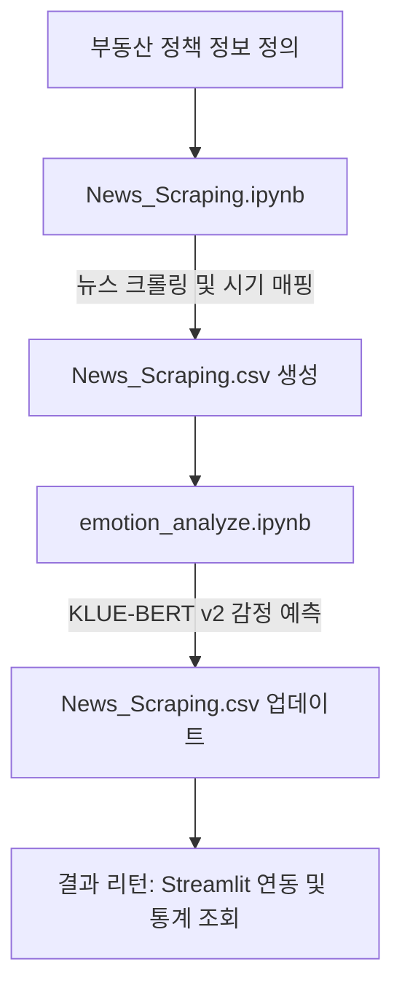

# 부동산 뉴스 기사 수집 및 감정 분석 시스템

이 프로젝트는 주요 부동산 정책 일정을 기준으로 뉴스 기사를 크롤링하고, 한국어 감정 분류 모델(**KLUE-BERT v2**)을 활용해 정책 시행 시기별 뉴스 기사 제목의 감정을 분석하여 통계 및 반응을 집계하는 파이프라인 시스템입니다.

---

## 🔄 1. 전체 데이터 분석 파이프라인

프로젝트는 수집 단계와 감정 분석 단계로 이루어집니다.



---

## 📂 2. 주요 파일 설명

1. **`News_Scraping.ipynb` (기사 수집 단계)**
   * 네이버 뉴스 등에서 주요 부동산 정책(박근혜, 문재인, 윤석열, 이재명) 발표 및 시행일을 기준으로 관련 기사들을 크롤링합니다.
   * 각 기사의 시점(시기)을 `시행전`, `시행일`, `초기반응`, `체감반응`으로 자동으로 매핑 및 분류하여 `News_Scraping.csv`를 신규 생성합니다.

2. **`emotion_analyze.ipynb` (감정 분석 단계)**
   * 수집된 기사제목의 감정을 추론하여 `감정`(한글 명칭) 및 `수치`(예측 확률) 열에 기입해 CSV 파일을 최종 업데이트합니다.
   * 특정 정책을 조회하면 시기별 감정 통계 DataFrame 및 감정별 기사 제목 리스트를 데이터(Dict/DF)로 리턴하는 분석 API 함수들이 구현되어 있습니다.

3. **`News_Scraping.csv` (데이터셋)**
   * 대통령, 정책, 정책요약, 시기, 날짜, 기사제목, url, 감정, 수치 등의 필드로 구성된 통합 데이터 파일입니다.

---

## 🛠️ 3. 환경 설정 및 설치

프로젝트 구동을 위해 다음 라이브러리를 설치해 주세요.

```bash
pip install transformers==4.44.2 huggingface-hub==0.24.7 torch pandas beautifulsoup4 requests
```

---

## 🚀 4. 핵심 분석 함수 사용 방법

### 4.1. 정책별 시기별 감정 통계 집계
#### `analyze_policy_emotions(df, policy_name)`
부동산 정책명을 기반으로 4가지 시기별(`시행전`, `시행일`, `초기반응`, `체감반응`) 감정 분류 분포(기사 수 및 평균 감정 신뢰도 스코어)를 산출해 리턴합니다.
* **입력**: 
  * `df` (DataFrame): 뉴스 데이터프레임.
  * `policy_name` (str): 분석할 부동산 정책 명칭 (예: `"4·1 부동산 대책"`).
* **반환**: 
  * `dict` 형태: `{ '시기명': DataFrame (Index: 감정, Columns: 기사수, 평균수치) }`
* **사용 예시**:
  ```python
  import pandas as pd
  df_analyzed = pd.read_csv("News_Scraping.csv")
  
  stats_results = analyze_policy_emotions(df_analyzed, "4·1 부동산 대책")
  # '초기반응' 시기의 통계 DataFrame 출력
  print(stats_results['초기반응'])
  ```

### 4.2. 정책별 시기별 감정별 기사 제목 추출
#### `get_policy_emotions_titles(df, policy_name)`
입력받은 정책의 시기별로, 해당 감정에 속하는 실제 기사 제목 리스트를 그룹화하여 반환합니다.
* **입력**:
  * `df` (DataFrame): 뉴스 데이터프레임.
  * `policy_name` (str): 분석할 부동산 정책 명칭.
* **반환**:
  * `dict` 형태: `{ '시기명': { '감정명': [ '기사 제목 1', '기사 제목 2', ... ] } }`
* **사용 예시**:
  ```python
  title_results = get_policy_emotions_titles(df_analyzed, "4·1 부동산 대책")
  
  # '초기반응' 시기에 '분노' 감정으로 예측된 기사 제목들 조회
  angry_titles = title_results['초기반응'].get('분노', [])
  for title in angry_titles[:5]:
      print("-", title)
  ```

---

## 💻 5. Streamlit 웹 연동 예시

함수 내부에서 print문을 사용하지 않고 순수한 데이터 구조만 반환하므로, Streamlit 앱에서 다음과 같이 바로 화면에 렌더링이 가능합니다.

```python
import streamlit as st
import pandas as pd
from emotion_analyze import analyze_policy_emotions, get_policy_emotions_titles

# 데이터 로드
df = pd.read_csv("News_Scraping.csv")
policy = "4·1 부동산 대책"

st.title(f"부동산 정책 반응 분석 대시보드: {policy}")

# 1. 통계 테이블 출력
stats = analyze_policy_emotions(df, policy)
st.subheader("시기별 반응 분포 표")
if stats.get('초기반응') is not None:
    st.dataframe(stats['초기반응'])

# 2. 감정별 기사제목 목록 리스트 형태로 출력
titles = get_policy_emotions_titles(df, policy)
st.subheader("초기반응기 분노 여론 기사")
angry_list = titles.get('초기반응', {}).get('분노', [])

if angry_list:
    for title in angry_list:
        st.write(f"😡 {title}")
else:
    st.write("해당하는 뉴스 기사가 없습니다.")
```
